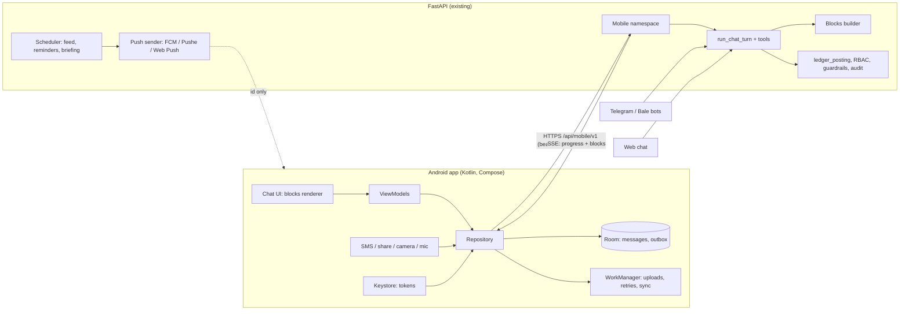

# Roadmap — an Android app that is only a chat (drafted 2026-10-07)

**The idea:** the whole app is one conversation with the accountant. There are no screens of forms and no menus of reports. A person talks, types, sends a photo of a receipt, shares a bank statement or forwards a bank SMS. The accountant answers with what they need: a figure, a short table, a chart, a PDF, or a card to confirm before anything is posted. It serves **personal users** (their own money, their household) and **companies** (owner, CFO, accountant, staff), and one person can have both.

**Sources:**
- a code inventory of the chat pipeline, auth, tenancy, files, notifications and every module's reach from chat (2026-10-07);
- the Telegram/Bale bots, which already run the same accountant as a chat-only client;
- the web app and its PWA;
- Google Play's SMS permission policy and HMRC's fraud-prevention rules for mobile apps.

**Ordering rule:**
1. First, the server contract that every chat client needs: the app, the bots and the web chat.
2. Then the smallest app someone uses every day.
3. Then breadth, until the chat reaches everything the web does that makes sense on a phone.

The money rules never change: the AI proposes, a person confirms, every posting can be undone or reversed, and the app obeys the same RBAC as the web.

Items are numbered by phase (`P0.3` is phase 0, item 3) so each can become a branch. The **Where** column names the file(s) involved today. **This is a plan for a later build; nothing here is scheduled.**


## Progress

The build started on 2026-10-10.

**Server (Phase 0):**
- ✅ **P0.1, P0.2** (#308): phone sessions and `/api/mobile/v1`.
- ✅ **P0.3, P0.4** (#309, #318): typed blocks; confirm, cancel and undo; threads that redraw their cards; Edit (the draft proposed again through the same checks, the old token withdrawn); approvals as cards, in the approver's briefing.
- ✅ **P0.5** (#314): streamed turns with their steps; `client_message_id` so a retry never asks twice.
- ✅ **P0.6** (#310, #316): fast paths, in Persian, English, Spanish and Arabic.
- ✅ **P0.7** (#312, #315): uploads, voice notes and the briefing; file blocks (an invoice's PDF), served to the phone's bearer session rather than by signed link. Resumable chunked uploads are not done: a photo is scaled to 1600 px (a few hundred KB) and the outbox uploads it once.
- ✅ **P0.9** (#317): threads `?since=`, messages paged by id (`before`, `after`, `X-More-Before`), and a message answered once however often the outbox sends it (`mobile_turns`, across server workers).
- ✅ The `chart` block (#323): the 13-week cash forecast drawn natively, and a fast path for "will we have enough cash?" in four languages (a what-if stays with the model).
- ✅ **P0.10** (#320): `docs/contracts/`, the block schema and recorded conversations, checked by the server and parsed by the Android tests; every mobile route in a table with its roles.
- **Still to do:** P0.8 push (it needs a Firebase project, or Pushe, from the owner).

**App (`android/`, Phase 1):**
- ✅ P1.1 (#311, #313): sign-in, two-factor, the app lock and the device list.
- ✅ P1.2: the chat with its blocks.
- ✅ P1.3 (#311, #318): confirm, edit, cancel, undo and the stamp.
- ✅ P1.4 (#313): the briefing and the fast-path suggestions.
- ✅ P1.7: RTL, Jalali and Persian digits, in both themes.
- ✅ Photos, files and voice notes (#313).
- ✅ The Phase 2 share target (#313): a bank SMS, a statement or a receipt shared in from another app.
- ✅ P1.5 (#317): the offline outbox. Every message is kept (sealed with a Keystore key) before it is sent, waits under its bubble while offline, and sends itself when the network is back, from the app or from WorkManager with the app closed. A refused one offers Try again or Don't send.
- ✅ Part of P2.7 (#316, #317): the conversations sheet, paged history, catching up when the app comes back.
- ✅ P2.8, the languages (#316): the app in Arabic and Spanish.
- ✅ The phone's half of P2.3 (#322): a shared statement's card (counts, the balance gap) and its differences one voucher at a time, with no model call.
- ✅ The approvers' half of P2.6 (#318): a voucher above the approval limit reaches the owner, CFO or manager as a card to approve or reject. Staff submitting claims by chat waits for the owner's decision (§11.7).
- **Still to do:**
  - P1.6: push;
  - P1.8: the store listings, the privacy policy and the Play data-safety form (crash reports without message content are done, #321, sent to our own server);
  - P1.9: signing and the store channels.

---

## 0. Where we start

Most of the app already exists on the server. The accountant runs a single tool loop, the same one behind the web chat and the bots, and the bots prove that chat alone can run the books.

| Capability | Today | What the app still needs |
|---|---|---|
| **AI tool loop** | `POST /ai-accountant/chat` → `orchestrator.run_chat_turn`. About 70 tools: reads, proposals, invoices, cheques and installments, payroll, time billing, equity, budgets, close and locks, insights, cash forecast, report card, correction memory. A separate registry for personal mode | A reply format a native app can draw (see P0.3) |
| **Propose → confirm → undo** | Every write is an `AIProposal` with a 10-minute token. `POST /execute` is idempotent; undo within 120 s, reverse at any time. Two-person approval above a threshold (`guardrails.py`) | A cancel endpoint (only the web page cancels today), edit-and-repropose, and approvals as chat actions |
| **Chat-only client** | Telegram/Bale bots (`services/messenger.py`): same tool loop as the linked user, inline Confirm/Cancel, voice notes transcribed | The bots don't accept files yet. The app goes past them: drawn cards, offline capture, SMS, push |
| **Files in chat** | `POST /transactions/attachments` (8 MB; images, PDF, CSV, Excel). Receipts are OCR'd; statements and spreadsheets go through deterministic intakes (`statement_intake`, `file_intake`) | Resumable uploads for poor networks; files coming *back* in chat (no reply carries a PDF today) |
| **Voice** | `POST /ai-accountant/transcribe` (Gemini, then `gpt-4o-mini-transcribe`) | Persian number handling ("دو و نیم میلیون", tomans vs rials) under test |
| **Documents** | WeasyPrint PDFs for invoices, quotes, POs, payslips, statements of account and financial statements; XLSX exports | A `file` reply block with a short-lived signed link |
| **Notifications** | Bell feed (`/notifications/feed`), Web Push with VAPID (`services/web_push.py`), a 15-minute scheduler, daily digest | Native push (FCM; Pushe or similar in Iran) behind one provider-agnostic sender |
| **Login** | Cookie session (`aa_session`, 24 h) and double-submit CSRF; TOTP 2FA; no refresh token. Bearer only for `/api/v1` service keys | **Blocker:** bearer access tokens with refresh tokens per device |
| **Tenancy** | One user belongs to one company (`users.company_id`); `kind = business \| personal`; household invites for personal | **Blocker for "personal and company in one app":** memberships and switching books |
| **Roles** | Seven roles; chat needs `books:write`, so manager, employee and viewer can't chat | Read-only chat for viewers; expense and time submission for staff |
| **Speed** | No streaming; a turn takes about 9 s on `gpt-4.1-mini` | Progress events while the tools run; deterministic fast paths for common questions |
| **API shape** | Unprefixed routes; OpenAPI is off in production; the earlier SwiftUI client drifted onto an old endpoint and was moved out (`fb5dcd3`) | A versioned mobile namespace with a published, contract-tested schema |

**What chat can't reach yet:**
- **Not at all:** quotes, credit notes, recurring invoices, invoice e-mail and PDFs, Moadian, MTD VAT, ITSA, TTMS, net worth and holdings, household, payslip lists, CFO/CEO reports, approvals, bank SMS.
- **Read only:** inventory, fixed assets, petty cash, purchase orders and FX.
- **Web-only, and fine that way:** company setup, users and roles, chart-of-accounts editing, branding.

---

## 1. Product principles (every phase keeps these)

1. **One screen.**
   - Threads, a books badge and settings are the only chrome.
   - Anything that needs a big table becomes a file in the chat: a PDF or an Excel sheet to open or share.
   - A few things stay on the web on purpose. The chat says so, with a link.
2. **The AI never writes on its own.**
   - Every change is a card: what, how much, which party, which accounts, which date in the company's calendar, and **which books**.
   - Then there's an Undo for two minutes, and Reverse after that. Amounts over the company's threshold wait for a second person.
3. **Figures come from the books, not from the model's prose.**
   - The model picks *what* to show; the server fills the numbers in from the tool results.
   - A total in a card is never a number the model typed. This removes the most dangerous failure in an AI accountant: a confident, wrong sum.
4. **Persian first.**
   - Right-to-left, the Jalali calendar, Persian digits, and rials stored while people speak in tomans.
   - English (UK, Gregorian, £) is the second market; Arabic and Spanish follow, as on the web.
5. **Capture fast, file later.**
   - A photo, a voice note, a forwarded SMS or a shared PDF is accepted offline and queued.
   - It becomes a draft card when the network is back. Nothing is lost to a bad connection.
6. **One question at a time.**
   - When something is missing, the accountant asks one clear question, with chips for the likely answers.
   - It never presents a form, unless a short one is genuinely clearer: a new employee, say.
7. **The same rules as the web.**
   - The app is just another client of the same RBAC, period locks, guardrails and audit log.
   - A viewer can ask but not post. A locked month stays locked.
8. **Private by default.**
   - App lock with biometrics or a PIN.
   - No amounts in notification text unless the user turns them on.
   - Bank SMS is filtered on the phone, so only messages from known bank senders leave it.

---

## 2. Who uses it

| User | Books | What they do in the chat | Must-haves |
|---|---|---|---|
| **Personal** | `kind = personal`, maybe shared with a household | Salary and spending, bank SMS, receipts, budgets, installments and loans, personal cheques, gold and currency, savings goals, net worth, the monthly report card | SMS capture, budget alerts, installment reminders, report card |
| **Sole trader / freelancer** | A small business; UK self-employed or an Iranian shop | Sales and costs, invoices, payments, time billing, VAT (UK), quarterly income tax updates (UK) | Invoice → PDF → share in two messages; "what do I owe HMRC?" |
| **Owner / CEO** | Company, role `owner` | Morning briefing, cash, who owes us, approvals, CEO/CFO Mode, health grade | Proactive messages, approve from a notification |
| **Accountant / CFO** | Company, role `accountant` / `cfo` | Posting, statement reconciliation, cheques, payroll, VAT/Moadian, close and locks | Statement intake, batch approve, payroll preview |
| **Staff** | Company, role `manager` / `employee` | Submit a receipt or an expense claim, log time, ask about their own claims | **New:** submissions that wait for an approver (today they can't chat at all) |
| **Several books** | Personal + their company, or an accountant with clients | Everything above, in the right books | **New:** memberships, a books switcher, the books named on every card |

**One app, not two.** A personal user who starts a company, or an owner who keeps personal books, shouldn't need a second app. The books badge at the top of the chat is always visible. "Switch to Arman" or "برو تو دفتر شخصی" changes it, and every card shows the books' name and colour.

---

## 3. The conversation model

### What the user can send

| Input | How | Notes |
|---|---|---|
| Text | Keyboard; Persian or English digits | Amounts like "۲۵۰ هزار تومن", "2.5m", "۲٫۵ میلیون" |
| Voice note | Hold to talk | Transcribed on the server. The text appears first so it can be corrected; a setting sends it straight away |
| Photo | Camera with edge detection, several pages | Receipts, invoices, cheques. Compressed on the phone (~1600 px) |
| File | Picker, or the Android **share sheet** from a bank app, e-mail, Telegram, Bale or Eitaa | Statements (PDF, Excel, CSV), supplier invoices, journal exports |
| Bank SMS | Read automatically with permission, or shared to the app | Only known bank senders; parsed by the server's format-agnostic parser (#156) |
| Contact | Share a contact | Creates or matches a party |
| Tap | Chips, card buttons | Confirm, Edit, Cancel, Undo, a choice, "Show more" |

### What the accountant sends back: typed blocks

A reply is a list of **blocks**. Each block carries a `fallback_text`, so an older app, a bot or a screen reader still gets a sentence.

| Block | Shows | Example |
|---|---|---|
| `text` | Markdown subset | An explanation, an answer |
| `proposal` | A card to confirm: summary, lines, party, amount, date, **books**, approval state; Confirm / Edit / Cancel | "Spending 2,500,000 rials — Groceries" |
| `posted` | What was posted, with an Undo countdown, then Reverse | "Posted · Undo (1:54)" |
| `figure` | One number with its comparison | "Cash 1.2 bn rials, ▼ 8% on last month" |
| `table` | At most ~8 rows, plus "Full report" (a file) | Who owes us, top five |
| `chart` | A small bar, line or sparkline from server data, drawn natively | Six months of spending |
| `choices` | Chips for one question | "Groceries · Restaurant · Other" |
| `file` | A PDF or XLSX: name, size, Open / Share | An invoice, payslips, a VAT return |
| `intake` | A statement or spreadsheet review: counts, matched / new / duplicates; Approve all / Review | A bank statement of 143 lines |
| `approval` | A request for an approver: who asked, what, how much; Approve / Reject | A payment over the threshold |
| `form` | A short form, only when genuinely clearer | A new employee |
| `web_link` | "This is easier on the web", with a deep link | Chart of accounts editor |

```json
{
  "turn_id": "t_9f2c",
  "books": {"id": "c_17", "name": "Arman Co", "kind": "business", "color": "#2E7D32"},
  "blocks": [
    {"type": "proposal",
     "token": "p_51a…", "expires_at": "2026-10-07T12:40:00Z",
     "summary": "Sales invoice to Aria Co — 3 h consulting",
     "amount": {"value": 60000000, "currency": "IRR", "display": "۶۰٬۰۰۰٬۰۰۰ ریال"},
     "date": {"iso": "2026-10-07", "display": "۱۵ مهر ۱۴۰۵"},
     "lines": [{"account": "1112", "name": "حساب‌ها و اسناد دریافتنی تجاری", "debit": 60000000},
               {"account": "4110", "name": "فروش", "credit": 60000000}],
     "new_entities": [],
     "needs_approval": false,
     "actions": ["confirm", "edit", "cancel"],
     "fallback_text": "Sales invoice to Aria Co, 60,000,000 rials, 15 Mehr 1405. Confirm?"}
  ]
}
```

### Threads and proactive messages

- **Threads:**
  - A default "Today" thread, plus one per topic ("Mehr payroll", "VAT Q2"), using the server's sessions.
  - Search across threads. Reopening a thread redraws its cards, not only its text.
- **The assistant speaks first:**
  - **Opening the app:** today's briefing (`/ai-accountant/briefing`, no AI call).
  - **Reminders:** a cheque due tomorrow, an installment, a VAT deadline, a budget passed or an approval waiting each arrive as a message with buttons: Mark paid, Snooze, Show.
  - **Push:** a notification opens straight to that message.

---

## 4. Architecture



### The client

- **Kotlin with Jetpack Compose**, one activity.
- **Libraries:** OkHttp/Retrofit (or Ktor) with kotlinx.serialization; **Room** for the message cache and the offline outbox; **WorkManager** for uploads, retries and the fallback sync; DataStore plus the **Android Keystore** for tokens; BiometricPrompt for the app lock.
- **Why native, not Flutter or React Native:** almost everything that makes this app worth more than the PWA is Android itself:
  - SMS and the notification listener;
  - the share target;
  - background work under Doze;
  - notification channels, app shortcuts and a quick-capture tile;
  - first-class RTL.
- **iOS later** (P5) shares the *contract*, not the code: Kotlin Multiplatform for the networking and models if that's wanted then.
- **No hard dependency on Google Play services.** Many phones in Iran don't have them (Huawei, custom ROMs) or can't reach them. So:
  - document edge detection uses CameraX with an on-device model or OpenCV, not the GMS-only scanner;
  - speech goes to our `/transcribe`, not Android's recogniser.
- **minSdk 26 (Android 8)** to cover older phones in Iran; review against real install data before P1.
- **APK under ~15 MB.**
- **Build flavours:** `play`, `bazaar` and `direct`. They differ only in SMS reading, the push provider, billing and the update check.

### The server (new work, all reusable by the bots and the web chat)

| # | Item | Why | Where |
|---|---|---|---|
| P0.1 | **Bearer sessions for apps:**<br>• a short access token (~15 min) and a rotating refresh token per device<br>• reuse the existing login + TOTP challenge<br>• a `devices` table (name, platform, push target, last seen)<br>• the device list and "log out this device" in settings (web and chat)<br>• no CSRF for bearer requests, which aren't ambient; cookies stay for the web | Cookies plus double-submit CSRF and a 24 h session with no refresh can't serve a phone | `app/core/auth.py`, `app/main.py` `auth_middleware`, `app/api/auth.py` |
| P0.2 | **A versioned mobile namespace** `/api/mobile/v1`:<br>• thin routes over the existing services<br>• its own published OpenAPI<br>• `X-App-Version`; the server can answer 426 "please update"<br>• unknown block types degrade to `fallback_text` | The SwiftUI client drifted onto a dead endpoint (`fb5dcd3`); a contract stops that | new `app/api/mobile/` |
| P0.3 | **Typed reply blocks** built from tool results, not model prose. The model chooses the kinds, the server fills in the numbers and formats them for the books' locale and calendar. Stored with the message, so history redraws cards | Principle 3; today a reply is Markdown plus proposals, and history loses the cards | `orchestrator.py`, new `ai_accountant/blocks.py`, `ChatResponse` |
| P0.4 | **Proposal lifecycle:**<br>• `POST /proposals/{token}/cancel`<br>• Edit: re-propose with the changed fields, invalidating the old token<br>• return `new_entities` (dropped by `ChatProposal` today)<br>• approvals as blocks and tools | Cancel exists only in the web page; staff and approvers need it in chat | `execute_service.py`, `guardrails.py`, `ai_accountant.py` |
| P0.5 | **Streaming turns:**<br>• `POST /chat/messages` with a `client_message_id` (idempotent), returning a `turn_id`<br>• SSE events: received, reading the receipt, looking up Aria Co, block, done | A 9-second silence feels broken on a phone; the retries of a flaky network must not post twice | `ai_accountant.py`, `orchestrator.py` |
| P0.6 | **Fast paths without the model** for the common questions: balance, cash, who owes us, what we owe, this month's spending, budget left, next cheques. This extends the deterministic intakes that exist | Under a second, cheaper, and exact | new `ai_accountant/fast_paths.py` |
| P0.7 | **Files both ways:**<br>• resumable, chunked uploads with hash dedupe<br>• `file` blocks: a signed, short-lived link to the PDFs and exports that exist | Uploads fail on mobile data in Iran; chat never returns a file today | `transactions` attachments, `services/documents/` |
| P0.8 | **Provider-agnostic push:**<br>• `push_targets` of kind `webpush`, `fcm`, `pushe` (and `hms` if needed)<br>• the payload carries only an id; the app fetches the message (private, and any provider works)<br>• WorkManager's periodic sync is the fallback when no provider gets through | Web Push only today; FCM is unreliable for Iranian users | `services/web_push.py` → `services/push/`, `jobs/scheduler.py` |
| P0.9 | **Sync with cursors:** threads, messages and the feed `?since=` | Offline-first needs cheap catch-up | sessions and messages routes, `notifications.py` |
| P0.10 | **Contract tests:**<br>• every block type, every mobile route under the RBAC matrix<br>• a recorded set of conversations replayed against the blocks builder | One contract for three clients | `tests/` |

---

## 5. Everything, by chat

The full map from what someone says to what they get. **Tool today** is the existing AI tool or endpoint; **Work** is what's missing; **Phase** is when it lands.

### Personal

| Say / send | You get | Tool today | Work | Phase |
|---|---|---|---|---|
| "۲۵۰ هزار تومن ناهار" · "paid 45 for fuel" | `proposal` → `posted` | `propose_create_transaction` | Toman/rial rule shown on the card | P1 |
| A receipt photo | OCR → `proposal` | attachments + OCR | Resumable upload | P1 |
| A bank SMS (auto or shared) | A draft `proposal`, or auto-posted by a rule the user set | `/bank-sms` (not in chat) | SMS tool + on-phone sender filter | P2 |
| A statement PDF / Excel | `intake` review | `statement_intake` | Blocks for the intake | P2 |
| "How much did I spend on food this month?" | `figure` + `chart` | `get_spending_summary` | Fast path | P1 |
| "Set a 10m food budget" · budget passed | `proposal`; later a proactive message | `propose_set_budget`, budget alerts | Push | P1 / P2 |
| "Next installment?" · "paid the car loan" | `table`; `proposal` | `list_commitments`, `propose_settle_commitment` | Reminders as messages | P2 |
| "My report card for Shahrivar" | `figure`s, `chart`, `file` | `get_report_card` | Blocks | P1 |
| "How much is my gold worth?" · "Net worth" | `figure` + breakdown | — (web only) | New `get_net_worth` / holdings tools | P3 |
| "Add Sara to our household" | `proposal` (invite) | `/personal/household` | New tool | P3 |
| "Saving for a car, 2 bn by Esfand" | `proposal`; progress `figure` | `get_savings_goals` | Create/update goal tool | P3 |

### Company

| Say / send | You get | Tool today | Work | Phase |
|---|---|---|---|---|
| "Paid rent 80m from Mellat" | `proposal` → `posted` | `propose_create_transaction` | — | P1 |
| "Who owes us?" · "What do we owe?" | `table` (aging) + "Full report" `file` | `list_invoices`, `trade_balances` | Aging tool + fast path | P2 |
| "Invoice Aria 3 h consulting at 20m" | `proposal` → `file` (PDF) → Share | `propose_create_invoice` | PDF block; e-mail/SMS send | P2 |
| "Aria paid 60m" | `proposal` | `propose_record_invoice_payment` | — | P2 |
| "Quote for …" · "credit note …" · "every month invoice …" | `proposal`, `file` | — | Quote, credit-note, recurring-invoice tools | P3 |
| A cheque photo · "cheque 1234 cleared" · "bounced" | `proposal` | `propose_create_cheque`, `propose_cheque_step`, `propose_bounce_cheque` | Cheque OCR fields (Sayad id) | P2 |
| "Run Mehr payroll" → "post" → "pay" | A preview card per employee + totals; then `posted` | `get_payroll`, `propose_run_payroll`, `propose_post_pay_run`, `propose_pay_pay_run` | Payslips and the insurance/tax lists as `file`s | P3 |
| "Log 3 h on Arman website" · "bill unbilled time" | `proposal` | time tools | — | P3 |
| Staff: a receipt photo | `proposal` that **waits for approval** | — | Submit-for-approval role behaviour | P2 |
| Approver: a push "Reza claims 4.2m" | `approval` → Approve / Reject | `/approvals` endpoints | Approval tools and blocks | P2 |
| "How are we doing?" · CEO / CFO Mode | `figure`s, `chart`s, risks, health grade; `file` | `/brain/cfo/report`, `/brain/ceo/report` | `get_cfo_report` / `get_ceo_report` tools returning blocks | P3 |
| "Cash in 30 days?" | `chart` + `figure` | `get_cash_forecast` | Blocks | P3 |
| Anomaly found overnight | A proactive message with the entry | `get_insights`, anomalies job | Push | P3 |
| "Received 10 of item X at 100" · "sold 4" | `proposal` | — (read only) | Movement tools; **depends on the stock-to-ledger decision** (the inventory gap in scenario M2) | P4 |
| "Bought a laptop, 36m, 3 years" · "run depreciation" | `proposal` | — (read only) | Asset and depreciation tools | P4 |
| "VAT this quarter?" (UK) → "file it" | `table` of the nine boxes, deadline; `file`; submission | `get_tax_summary` | Return preview; submission once HMRC credentials exist, with fraud headers (P4.3) | P4 |
| "ITSA update for Q2" (UK) | `table`; `file` | — | ITSA summary tool | P4 |
| Moadian invoices (IR) | Status `table`; `proposal` to send | — | Waits on the Moadian API (roadmap 3.1) | P4 |
| "Lock Shahrivar" · "close checklist" | `proposal`; checklist `table` | `propose_lock_period`, `get_close_checklist` | — | P4 |
| "Who changed this entry?" | `table` | `get_audit_trail` | — | P3 |
| "Invite Ali as accountant" | `proposal` | — (admin pages) | Invite tool, owner only | P3 |
| Chart of accounts, company setup, branding, journal import | `web_link` | web | Stays on the web by design | — |

---

## 6. Phases

The sizes assume one Android developer, one backend developer and a part-time designer and QA. They are for planning, not commitments.

### Phase 0: server foundations (4–6 weeks; no app yet)

**Scope:** P0.1–P0.10 above.

**The first benefit is today's clients:** the bots gain cancel and files, and the web chat gains redrawn history and streaming.

**Done when:**
- a scripted client logs in with 2FA, chats, confirms, undoes and receives a push, entirely through `/api/mobile/v1`;
- every block type has a contract test;
- the RBAC matrix covers the namespace.

### Phase 1: the pocket accountant (6–8 weeks)

**For:** personal users and owners, in Persian and English, with **one book per user**.

| # | Item |
|---|---|
| P1.1 | Login, 2FA, biometric/PIN lock, device list; the books badge |
| P1.2 | The chat: text, voice, photo; block rendering for `text`, `proposal`, `posted`, `figure`, `table`, `chart`, `choices`, `file` |
| P1.3 | Confirm / Edit / Cancel / Undo / Reverse, with the books named on every card |
| P1.4 | The opening briefing; fast paths for balance, cash, spending, budget |
| P1.5 | Offline outbox: captures queue and retry with idempotency keys; a clear "waiting for network" state |
| P1.6 | Push (P0.8): reminders and budget alerts as messages |
| P1.7 | RTL and Jalali throughout; Persian digits; Vazirmatn; dark mode; font scaling |
| P1.8 | Crash reporting without message content; privacy policy; the Play data-safety form |
| P1.9 | Release: Play internal testing, Bazaar beta, a signed direct APK for testers in Iran |

**Done when:**
- **Usage:** 20 real users have used it for two weeks;
- **Speed:** ≥ 85% of capture tasks are completed in three turns or fewer;
- **Safety:** there are **zero** postings to the wrong books;
- **Stability:** crash-free sessions are ≥ 99.5%;
- **Latency:** the median first block arrives in ≤ 2 s (progress) and the answer in ≤ 10 s.

### Phase 2: daily operations (8–10 weeks)

| # | Item |
|---|---|
| P2.1 | **Several books:**<br>• `memberships(user, company, role)` and a switch endpoint; the token carries the active books<br>• the switcher in chat ("switch to …") and at the badge<br>• the first posting after a switch asks once more<br>• a security review: the tenancy filter, caches and audit |
| P2.2 | **Bank SMS:** on-phone filter of bank senders → `bank_sms` → draft or rule-based auto-post; the share-to-app path on the Play build (§7.1) |
| P2.3 | **Statements:** share a PDF or Excel from the bank app → `intake` → Approve all / Review |
| P2.4 | **Invoices:** create, PDF, share via the share sheet (Telegram, Bale, Eitaa, WhatsApp, e-mail); record payments; the aging |
| P2.5 | **Cheques and installments:** create from a photo, the steps, bounce, settle; reminders the day before |
| P2.6 | **Staff and approvals:**<br>• managers and employees can chat within their role: receipts and claims become proposals that wait<br>• approvers get an `approval` push and act on it<br>• viewers get read-only chat |
| P2.7 | Threads and search; reopened threads redraw cards; pinned answers |
| P2.8 | Arabic and Spanish; the UK locale end to end (Gregorian, £, VAT wording) |

**Done when:** an accountant runs a week of a real company's books from the phone (statements, cheques, invoices, approvals) and finds nothing they had to finish on the web.

### Phase 3: management and insight (6–8 weeks)

| # | Item |
|---|---|
| P3.1 | **CEO and CFO Mode as messages:** the weekly briefing, the health grade, risks, cash forecast; "Full report" as a PDF |
| P3.2 | **Anomalies and insights** pushed when found, each with its entry and "fine / fix it" |
| P3.3 | **Payroll in chat:** run, post, pay; payslips and the insurance and tax lists as files; payslips shared to employees |
| P3.4 | Time billing; quotes, credit notes, recurring invoices |
| P3.5 | **Personal:** net worth and holdings (gold, currency, with the price feed), savings goals, household invites |
| P3.6 | Owner admin by chat: invite a user with a role, revoke a device |
| P3.7 | Android extras:<br>• a home-screen widget (cash, budget left)<br>• a quick-capture tile and app shortcuts ("photo a receipt", "record spending")<br>• a direct-share target |

**Done when:** an owner says the morning briefing replaced opening the web dashboard, measured by usage and a short interview.

### Phase 4: compliance and the heavy modules (8–12 weeks, plus waits for outside parties)

| # | Item |
|---|---|
| P4.1 | **UK VAT:** the nine boxes, the deadline, the return as a PDF; submission when HMRC credentials exist (roadmap 3.6) |
| P4.2 | **ITSA** quarterly updates (UK) |
| P4.3 | **HMRC fraud-prevention headers for the app:**<br>• the connection method is "mobile application via server"<br>• the app sends the device data HMRC requires (device id, screens, timezone, user agent…) with each request that leads to a submission<br>• the server forwards it as `Gov-Client-*` headers<br>• HMRC's validator passes |
| P4.4 | **Moadian (IR):** sending status and failures as messages, once the direct API is in place (roadmap 3.1) |
| P4.5 | **Inventory movements by chat**, after the stock-to-ledger decision |
| P4.6 | **Fixed assets:** add, depreciate, dispose |
| P4.7 | Period close: the checklist, locks, year-end with the accountant |
| P4.8 | A tablet layout: two panes, thread list and chat |

**Done when:** a UK sole trader files a quarter's VAT and ITSA update from the phone in a sandbox, and an Iranian company's month closes from the phone except where the web is used by design.

### Phase 5: beyond (no dates)

- **iOS:**
  - the same contract and tests, with the SwiftUI client brought back onto `/api/mobile/v1`;
  - or Kotlin Multiplatform for the shared layer.
- **Passkeys** (Credential Manager), next to passwords and TOTP.
- **Practice mode:** an accountant's inbox across clients' books, with approvals and reminders merged.
- **Hands-free voice mode:** speak, hear the answer, confirm by voice with a spoken amount check.
- **A small on-device model** for categorising SMS and receipts offline; the server still decides what posts.

---

## 7. Android specifics

### 7.1 Reading bank SMS

- **Google Play:**
  - `READ_SMS` / `RECEIVE_SMS` are restricted to default SMS apps and a list of exceptions.
  - "SMS-based money management" (apps that track and manage budget) is on that list, but only **after Google approves a Permissions Declaration Form**.
  - So: apply for the exception, and build the Play flavour to work without it, through the share sheet ("Share → Accountant"), copying an SMS (the app offers it when it opens), and optionally a notification listener for bank apps (a sensitive setting the user turns on).
- **Bazaar, Myket and the direct APK:** automatic reading, after checking each store's current rules.
- **Privacy, in every flavour:**
  - Only messages from a list of bank senders are read, matched on the phone.
  - The text is sent with its sender and time. Nothing else leaves the phone.
  - The user sees each one as a draft until they set a rule ("always post Mellat card spending").
- **Prompt injection:** an SMS is **untrusted input** to the AI, like a document. The existing guardrails for documents (roadmap 5.6) apply to SMS text too.

### 7.2 Push in Iran

- **The problem:** FCM has been unreliable or blocked for Iranian developers and users since 2022 (sanctions).
- **Plan:**
  - Pushe (or a similar local provider) in the `bazaar` and `direct` flavours, and FCM in `play`, all behind the provider-agnostic sender (P0.8).
  - WorkManager's periodic sync (every 15 minutes at best, under Doze) as the floor.
  - No always-on socket: it drains the battery and Android kills it.

### 7.3 Distribution and updates

| Channel | Market | Notes |
|---|---|---|
| Google Play | UK, diaspora | Play Billing for in-app subscriptions; the data-safety form; the target API level in force at release |
| Cafe Bazaar, Myket | Iran | Their in-app billing (e.g. Poolakey) if subscriptions are sold in the app |
| Direct signed APK | Iran, testers | Downloaded from our site; the app checks for updates and offers them; the same signing key for every channel that allows it |

Subscriptions could also stay on the web for every channel, which avoids store billing. That is decision 6 in §11.

### 7.4 Phones and networks in Iran

- **Phones:** older, low-memory phones are common. Hence a small APK, no hard Google Play services dependency, lazy chart drawing, and paged history.
- **Networks:** slow, filtered or cut. Hence:
  - an offline outbox and resumable uploads;
  - retries with idempotency keys and sensible timeouts;
  - images compressed on the phone;
  - a short list of API base URLs to fail over between, shipped in the app and refreshed by it.

### 7.5 Security

- Tokens in the Keystore.
- Biometric or PIN lock after a chosen idle time.
- Optional `FLAG_SECURE` (no screenshots) for the chat.
- Certificate pinning with a backup pin.
- Remote logout from the web and from chat.
- A warning, not a block, on rooted phones.
- No message content in crash reports or analytics.

### 7.6 Accessibility

TalkBack labels on every block (from `fallback_text`), font scaling up to 200%, contrast in both themes, and RTL mirroring checked in screenshot tests.

---

## 8. The accountant's behaviour in a chat-only app

| # | Item | Why |
|---|---|---|
| 8.1 | **"What can you do?"** answers for this user's role and books, with example chips; first-run chips teach by doing | No menus means discovery happens in the chat |
| 8.2 | **The books in every decision:**<br>• ambiguous wording asks which books<br>• a personal-sounding spending in company books asks once ("this looks personal — post to your personal books?") | The worst mistake of a two-books app |
| 8.3 | **Tomans and rials:**<br>• spoken amounts are read as tomans when the user says so, or when the user's remembered preference (correction memory) says so<br>• the card always shows the rial amount that will be stored | A 10× error is the most likely voice and SMS mistake |
| 8.4 | **Persian numbers in speech** ("دو و نیم میلیون", "صد و بیست هزار"), Persian and Arabic digits, and the separators ٬ and , are normalised and covered by tests | Voice is the fastest input on a phone |
| 8.5 | **Short replies:** one figure or one card first, details on request ("Show more"); never a wall of text | The screen is small |
| 8.6 | **Parties by chips:** "Aria" matching two parties shows both as chips; a new party is created inside the proposal (`new_entities` shown) | One question, not a form |
| 8.7 | **Edit by talking:** "make it 70m" or "yesterday, not today" re-proposes the open card | Natural correction |
| 8.8 | **Staff scope:** a staff member's chat sees only their own claims and time; the tools enforce it, not the prompt | RBAC lives in the server |
| 8.9 | **Evaluation:**<br>• a golden set of conversations per feature and language, run nightly with the real model on a scratch tenant<br>• success rate, turns per task and wrong-figure count tracked per release | The model and prompts will change; the behaviour must not |

---

## 9. Quality engineering

1. **Scenarios first, as on the web:**
   - a new group "N. Android chat" in `docs/qa/SCENARIOS.md`;
   - every app PR adds its numbered scenarios and runs them.
2. **Server:**
   - contract tests for each block type;
   - the mobile namespace in the RBAC matrix;
   - the recorded conversations replayed (P0.10);
   - a load test of streaming turns at the expected concurrency.
3. **App unit tests:** ViewModels and the outbox; amount and date formatting in four languages.
4. **Screenshot tests:**
   - Roborazzi or Paparazzi, for every block in Persian (RTL), English and Arabic;
   - light and dark, at font scale 1.0 and 1.3;
   - reviewed like the web screenshots.
5. **End to end on an emulator in CI:** against a scratch server with the QA tenants. Log in, capture, confirm, undo, offline then online, switch books.
6. **Device lab:**
   - an Android 8 phone with 2 GB of RAM;
   - a Huawei phone without Google Play services;
   - a mid-range Samsung;
   - a Pixel on the newest Android.
7. **Beta channels:** Play internal and closed testing, a Bazaar beta, and the direct APK for testers in Iran.
8. **Telemetry without content:**
   - task success, turns per task;
   - confirm, edit, cancel and undo rates;
   - the OCR correction rate;
   - time to the first block;
   - crash-free sessions.

---

## 10. Risks

| Risk | Mitigation |
|---|---|
| Posting to the wrong books | The badge and colour; the books on every card; one extra question after a switch; a scenario per release |
| The model gets money wrong | Proposals only; numbers filled by the server; server-side validation; undo and reverse; approvals above the threshold |
| Play refuses SMS reading | Share and copy paths in the Play flavour; automatic reading in Bazaar and direct |
| Push doesn't arrive in Iran | Pushe plus periodic sync; reminders are also in the feed when the app opens |
| A 9-second turn feels broken | Streaming progress; fast paths; a smaller model for the easy turns |
| Dense work doesn't fit a chat | Files in the chat and "open on the web" by design, without squeezing tables onto a phone |
| Two clients drift apart (it happened with SwiftUI) | One versioned namespace; contract tests; server-built blocks |
| Several books per user widens the tenancy surface | A separate security review in P2.1; the exhaustive RBAC matrix; tests that a token can't read another books' data after a switch |
| AI cost per user | The existing per-user and per-company limits (`ai_limits`); fast paths for the common questions |
| UK compliance for a mobile client | HMRC fraud-prevention headers for "mobile application via server" (P4.3); UK GDPR privacy notice; the Play data-safety form |

---

## 11. Decisions needed from the owner

1. **Native Kotlin or Flutter?**
   - Recommended: native Kotlin, because the valuable parts are Android-specific.
   - Flutter only if an iOS app soon matters more than SMS and background capture.
2. **One app for personal and company, or two?** Recommended: one, with the books switcher (§2).
3. **Several books per login** (P2.1) is a real tenancy change. Is it in scope, or does a personal user who also owns a company keep two logins at first?
4. **Push in Iran:** Pushe, another local provider, or our own?
5. **SMS:** apply for Play's exception, or offer automatic reading only outside Play?
6. **Subscriptions:** sold in the stores (their billing and fees), or only on the web?
7. **Staff chat:** may employees submit claims by chat? With what limits, and who approves?
8. **What stays on the web on purpose:** the proposed list is chart of accounts, company setup, users and roles, branding and journal import. Anything to add or remove?

---

## 12. Suggested order of work

1. **Now** (before any app code; it helps the web chat and the bots today): P0.3 blocks · P0.4 cancel and approvals · P0.5 streaming · P0.6 fast paths. Then P0.1 bearer sessions and P0.2 the namespace.
2. **Next:** P0.7–P0.10, then Phase 1 to closed testing in Persian and English.
3. **Then:** Phase 2, with P2.1 several books first, since everything after it assumes it, and SMS and statements next.
4. **Later:** Phase 3, then Phase 4 as HMRC and Moadian access arrive, then Phase 5.

The design direction for all of it is §13.


---

## 13. Design direction (2026-10-10)

The board, with five screens in Persian and English and a live "confirm and stamp" example, is [`docs/design/android-chat.html`](design/android-chat.html). Open it in a browser.

### What 2026's best work does, and what we take from it

| Pattern | Seen in | Our decision |
|---|---|---|
| **Spring motion and morphing shapes**, "expressive by default, restrained when necessary" | Material 3 Expressive (Android 16; Google's apps moved over by Dec 2025) | Springs move the cards; a morphing `LoadingIndicator` shows the tools running; the one theatrical moment is the stamp |
| **A floating pill composer** | Gemini "Neural Expressive" (May 2026). Reviewers missed the suggestion chips it dropped | A floating translucent composer, and chips kept for the next likely step |
| **Inline UI before the model's words**, only when it makes the task faster | OpenAI's guidelines for apps in ChatGPT | Each reply opens with its block, then one short sentence; no carousels for money |
| **Plan → confirm → receipt → undo**, with friction matched to risk | 2026 agent launches; Smashing Magazine, Feb 2026 | Reading is free; posting is a voucher to confirm, then a stamped receipt with the two-minute undo |
| **Glass only on controls that float** over content | Apple Liquid Glass guidance | Translucency for the composer, the voice pill and sheets only; cards stay solid so figures stay legible |
| **A dark palette designed on its own**, not an inversion | "Dark mode 2.0" | A lapis night with lifted turquoise and warmer saffron, contrast-checked, kind to OLED |
| **Calm money and fresh numbers** | Copilot Money; fintech UX guides | Every figure carries a freshness dot and a comparison; totals open to show their lines |
| **Charts are craft** | Apple Design Awards 2026: Tide Guide won Visuals and Graphics | Charts drawn to scale, with an area fill, a faint grid and the latest point marked |

### Identity

**Colour.** The palette extends the web app's turquoise `#006d77`, saffron and navy ink into Persian tile colours. Each colour has one job:

| Token | Light | Dark | Job |
|---|---|---|---|
| Firouzeh | `#006d77` | `#5fc9cd` | actions, focus, the seal |
| Lapis | `#14243b` (ink) | `#09121c` (ground) | text by day, background by night |
| Saffron | `#a9650a` | `#f0b45a` | personal books, budgets, things waiting for you |
| Pomegranate | `#b23a26` | `#f17d68` | money leaving, overdue, reject |
| Paper | `#f1f5f6` | `#121d2a` (surface) | the ground, faintly blue |
| Indigo | `#2f4a9a` | `#93a8f2` | a third set of books |

Each set of books gets one of these colours. It appears on the books badge, every card and the stamp.

**Type:**
- **Vazirmatn** (OFL, variable) for Persian UI. Title 800 at 20/28; body 400 at 15/24; label 600 at 12/16; figures in tabular digits.
- **Roboto Flex** for English screens.
- **Reem Kufi**, a Kufic face echoing bannai tile lettering, for display moments only (onboarding, empty states, the store listing).
- Check that the shipped font builds space Persian digits evenly. Reem Kufi stretches the ZWNJ, so keep it to words without one.

**Shape:**
- **The voucher:** a draft is a سند card with a perforated fold above its buttons. Radius 20, notch 9.
- **Pills** for the composer, chips and button groups.
- **The round seal.**

### The signature: the stamp

Confirming a voucher presses a round seal onto it, the way an Iranian office stamps a finished document:
- **What it shows:** «ثبت شد», the voucher number and the date.
- **Where it sits:** straddling the tear line, never over a figure.
- **Undo** lifts it off.

Mechanics:
- **Motion:** a spring scale-and-rotate of about 520 ms, with the card pressed down a pixel.
- **Haptics:** `HapticFeedbackConstants.CONFIRM` (API 30+) on posting, `REJECT` on a refusal, a soft tick on chip selection.
- **Reduced motion:** with that system setting on, the seal simply appears.

### Rules every screen keeps

1. **The books are always named:** badge, card and seal. After a switch, the first posting asks once more.
2. **Money moves in full figures:**
   - vouchers show the whole rial amount in tabular digits;
   - short forms («۱٫۲ میلیارد») appear only in figures and tap to the exact sum.
3. **One accent per job:**
   - turquoise means you can act;
   - saffron means personal books or attention;
   - pomegranate means money leaving or something late;
   - nothing else is coloured.
4. **Motion means something happened:**
   - springs follow your finger, and the stamp marks a posting;
   - only listening and thinking animate on their own.
5. **Persian first:**
   - mirrored layout, right-to-left conversation, Persian digits, Jalali dates;
   - English screens switch every one of these.
6. **Private on the lock screen:**
   - no amounts in notifications unless the user turns that on;
   - fingerprint or PIN app lock.

### Building it

- **Compose and theme:**
  - Compose with `MaterialExpressiveTheme`, the expressive motion scheme and our colour scheme;
  - dynamic colour off, because books colours carry meaning;
  - the expressive components (`ButtonGroup`, `LoadingIndicator`, floating toolbar, FAB menu) are in the `material3` 1.5 alpha line behind `@OptIn(ExperimentalMaterial3ExpressiveApi::class)`, so pin the version.
- **Blur:** composer and sheet translucency uses `Modifier.blur`/`RenderEffect` on API 31+, with a solid surface below that.
- **Next steps:**
  - a clickable Compose prototype of the phase 1 screens;
  - five personal users in Tehran and three company owners try capture, confirm, undo and switching books;
  - what they stumble on goes back into the blocks before the server work ships.

**Sources:**
- [Material 3 Expressive launch](https://blog.google/products-and-platforms/platforms/android/material-3-expressive-android-wearos-launch/)
- [Gemini Neural Expressive hands-on](https://www.androidauthority.com/gemini-neural-expressive-android-app-hands-on-3668985/)
- [OpenAI UI guidelines](https://developers.openai.com/plugins/concepts/ui-guidelines)
- [Designing for agentic AI](https://smashingmagazine.com/2026/02/designing-agentic-ai-practical-ux-patterns/)
- [Liquid Glass](https://en.wikipedia.org/wiki/Liquid_Glass)
- [Copilot Money](https://9to5mac.com/2026/01/01/copilot-money-brings-clarity-to-your-finances-now-on-the-web/)
- [Fintech UI/UX 2026](https://www.theskinsfactory.com/uiux-design-blog/fintech-ui-ux-design)
- [Apple Design Awards 2026](https://www.apple.com/newsroom/2026/06/apple-reveals-winners-of-the-2026-apple-design-awards/)
---

## Appendix A: five conversations

**1. Personal: a bank SMS (Persian)**

> *(shared from the SMS app)* «بانک ملت — برداشت ۲٬۵۰۰٬۰۰۰ — مانده ۴۱٬۲۰۰٬۰۰۰ — ۱۴۰۵/۰۷/۱۵ ۱۲:۳۰»
>
> **Accountant:** `proposal` «هزینه ۲٬۵۰۰٬۰۰۰ ریال از کارت ملت، ۱۵ مهر» · `choices` [خوراک] [رستوران] [سایر]
>
> *(taps خوراک)* → `posted` «ثبت شد · برگرداندن (۱:۵۹)» · «بودجهٔ خوراک: ۶۰٪ از ماه مصرف شده»

**2. Company: an invoice shared on Telegram (Persian)**

> «برای شرکت آریا فاکتور بزن: ۳ ساعت مشاوره، ساعتی ۲۰ میلیون ریال»
>
> **Accountant:** `proposal` (60,000,000 rials, the lines, «دفتر: شرکت آرمان») → *(Confirm)* → `file` «فاکتور-۱۰۴۲.pdf» [باز کردن] [ارسال]
>
> *(Share → Telegram → Aria's accountant)*

**3. Payroll (Persian)**

> «حقوق مهر رو حساب کن»
>
> **Accountant:** `table` (each employee: gross, insurance, tax, net) · `figure` (total 1,005,545,550 cost) · [ثبت در دفاتر] [فیش‌ها]
>
> *(ثبت)* → `posted` → «پرداخت هم انجام شود؟» [از بانک ملت] [بعداً]

**4. An owner's morning (push → chat, English)**

> *Push:* "Your morning briefing is ready" (no amounts unless turned on)
>
> **Accountant:** `figure` Cash 1.2 bn (▼ 8%) · `table` 3 invoices overdue, 420m · "Payroll in 5 days; cash covers it." · `approval` "Reza: fuel claim 4,200,000" [Approve] [Reject]

**5. A UK sole trader's VAT (English)**

> "How much VAT do I owe this quarter?"
>
> **Accountant:** `figure` £100 payable by 7 November · `table` boxes 1–7 · [Get the return as PDF] [File with HMRC] (when submission is live)

## Appendix B: the mobile namespace, first cut

| Route | Purpose |
|---|---|
| `POST /api/mobile/v1/auth/login` · `/auth/2fa` · `/auth/refresh` · `/auth/logout` | Bearer sessions per device |
| `GET/DELETE /api/mobile/v1/devices[/{id}]` | Device list, remote logout |
| `PUT /api/mobile/v1/devices/{id}/push` | Register a push target (`fcm`, `pushe`, …) |
| `GET /api/mobile/v1/books` · `POST /books/switch` | Memberships and the active books (P2.1) |
| `GET /api/mobile/v1/threads?since=` · `GET /threads/{id}/messages?after=` | Sync |
| `POST /api/mobile/v1/chat/messages` | Send (text, attachment ids, `client_message_id`) → `turn_id` |
| `GET /api/mobile/v1/chat/turns/{id}/events` | SSE: progress and blocks |
| `POST /api/mobile/v1/proposals/{token}/confirm` · `/cancel` · `/edit` | Proposal lifecycle |
| `POST /api/mobile/v1/postings/{audit_id}/undo` · `/reverse` | Undo, reverse |
| `GET /api/mobile/v1/approvals` · `POST /approvals/{token}/approve` · `/reject` | Approvals |
| `POST /api/mobile/v1/uploads` (resumable) · `GET /files/{id}` (signed) | Files both ways |
| `POST /api/mobile/v1/bank-sms` | Raw SMS text, sender, time |
| `GET /api/mobile/v1/feed?since=` | Reminders and alerts |
| `POST /api/mobile/v1/transcribe` | Voice notes |
